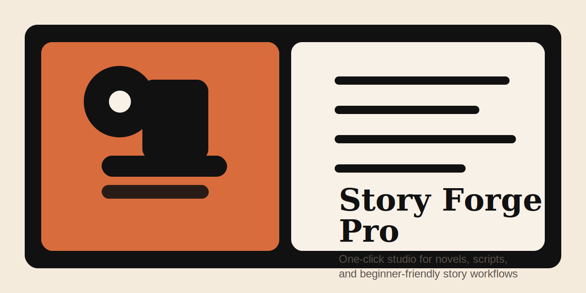
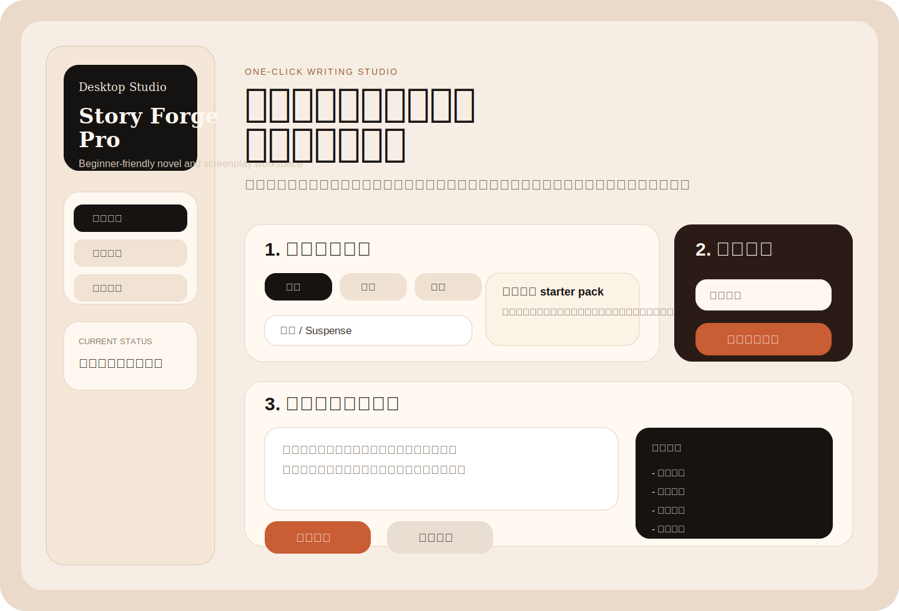
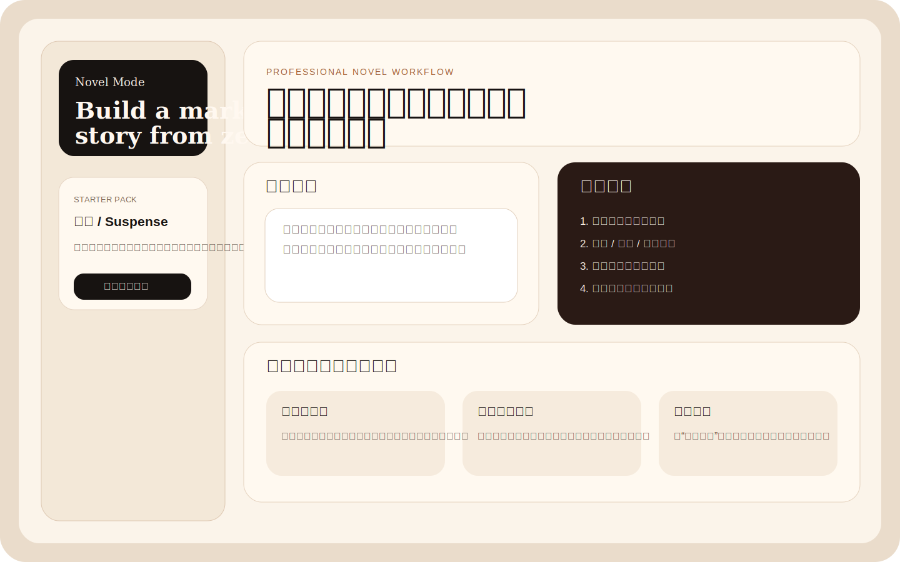
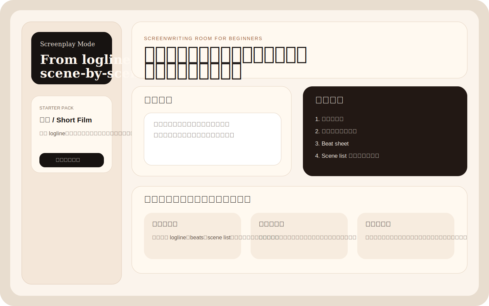

<div align="center">
  <h1>Story Forge Pro</h1>
  <p><a href="README.en.md">English</a> | <a href="README.md">简体中文</a> | <a href="README.ja-JP.md">日本語</a></p>
  <p>
    <a href="https://github.com/wimi321/story-forge-pro/actions/workflows/ci.yml"></a>
    <a href="LICENSE"></a>
    <a href="https://github.com/wimi321/story-forge-pro"></a>
  </p>
  
</div>

> 面向小白用户的一键式小说 / 剧本创作工作台。安装后双击即可启动，底层由 Claude Code 驱动，但工作流、提示词、角色分工、模板、项目脚手架和文档全部针对“专业写作”重做。

## 一眼看懂

| 你想要什么 | Story Forge Pro 怎么帮你 |
|---|---|
| 我完全不会写提示词 | 用 `npm start` 或桌面版一步步带你选 |
| 我想写小说但不会搭结构 | 先做题材、人物、冲突、大纲，再进入正文 |
| 我想写剧本但不会拆场 | 先做 logline、beat sheet、scene list，再写台词 |
| 我怕 AI 只会空话 | 默认输出大纲、卡片、清单、场景，不只给空泛段落 |
| 我不想折腾命令行 | 已有桌面版 UI，可点击配置、建项目、开始生成 |

## 为什么这个项目更适合小白

- 不要求你会 prompt engineering
- 不要求你先懂小说理论或剧本术语
- 不要求你先自己建项目结构
- 不把“写整本书”当成第一步
- 默认先把大任务拆成可以执行的小步骤

## 和普通 AI 写作工具的区别

| 维度 | 普通 AI 写作工具 | Story Forge Pro |
|---|---|---|
| 新手上手 | 默认你会提需求 | 默认你不会，先引导再生成 |
| 输出形式 | 容易直接吐大段文字 | 优先给大纲、场景、角色、清单 |
| 小说工作流 | 常常只会续写 | 从题材、人物、冲突到章节推进 |
| 剧本工作流 | 常常缺少 beat 和场景意识 | 先做 logline、beat sheet、scene list |
| 项目结构 | 常常是聊天记录 | 直接生成可保存的项目目录 |
| 使用方式 | 常常偏聊天 | 同时支持 CLI 傻瓜模式和桌面版 UI |
| 对傻瓜用户 | 说“你来决定” | 说“我来带你一步一步做” |

## 现在已经能做什么

- 命令行傻瓜模式：`npm start`
- 桌面版启动：`npm run desktop`
- 小说模式、剧本模式、大纲模式
- 自动生成项目目录
- 内置题材 starter packs
- 多平台打包脚本
- 多语言 README 和完整开源项目文档

## 桌面版预览



### 小说模式预览



### 剧本模式预览



## 文档导航

- [新手指南](docs/BEGINNER-GUIDE.md)
- [傻瓜模式说明](docs/BEGINNER-MODES.md)
- [桌面版说明](docs/DESKTOP.md)
- [对标分析](docs/BENCHMARK.md)
- [FAQ](docs/FAQ.md)
- [路线图](docs/ROADMAP.md)
- [展示方向](docs/SHOWCASE.md)
- [贡献指南](CONTRIBUTING.md)
- [安全策略](SECURITY.md)
- [更新日志](CHANGELOG.md)

## 它解决什么问题

大多数 AI 写作工具有两个毛病：

1. 对新手不友好，用户不知道该怎么提需求。
2. 会写几段漂亮话，但不会真的带你完成长篇小说或剧本生产流程。

`Story Forge Pro` 的目标不是“陪你聊灵感”，而是把你从一个想法，带到一套能落地执行的写作项目：

- 定位题材与卖点
- 搭建人物与冲突系统
- 产出大纲、章节卡、场景卡
- 连续推进正文或剧本
- 对对白、节奏、钩子、商业化方向做专业修订

## 核心特性

- 一键启动：`launch-novel.command` / `launch-screenplay.command` 双击即可跑起来
- 桌面版 UI：模式选择、配置保存、项目创建、实时输出全部可点击
- 小白友好：首次运行会自动进入配置向导，保存 `.env.local`
- 专业分工：内置 `story-architect`、`character-doctor`、`dialogue-polisher`、`scene-director`、`market-editor`
- 双模式创作：小说模式、剧本模式、纯大纲模式
- 项目模板：快速生成小说工程、剧本工程
- 多语言文档：中文、英文、日文 README
- GitHub 级工程化：CI、Issue 模板、MIT License、NOTICE、规范目录结构

## 使用入口

| 场景 | 推荐入口 |
|---|---|
| 完全新手 | `npm start` |
| 喜欢点按钮 | `npm run desktop` |
| 直接写小说 | `npm run novel` |
| 直接写剧本 | `npm run screenplay` |
| 只做前期规划 | `npm run outline` |

## 适合谁

- 从 0 开始写小说、网文、短篇、中长篇的人
- 想写电影、短剧、动画、游戏叙事的人
- 有创意但不会拆流程的人
- 想把 AI 从“聊天玩具”变成“创作生产力”的人

## 3 分钟上手

仓库地址：

```bash
git clone https://github.com/wimi321/story-forge-pro.git
cd story-forge-pro
```

### 1. 安装 Node.js

需要 `Node.js 18+`。

### 2. 安装依赖

```bash
npm install
```

### 3. 首次配置

```bash
npm run setup
```

脚本会要求你输入：

- `ANTHROPIC_API_KEY`
- 默认模型别名，默认是 `sonnet`
- 权限模式，默认是 `default`

### 4. 启动写作模式

如果你是纯小白，直接用这个：

```bash
npm start
```

它会一步一步带你选：

- 写小说还是剧本
- 题材方向
- 要不要自动创建项目文件夹
- 然后自动进入对应模式

最适合小白的双击入口：

- `launch-start.command`
- `launch-start.bat`

如果你想直接打开桌面应用：

```bash
npm run desktop
```

小说模式：

```bash
npm run novel
```

剧本模式：

```bash
npm run screenplay
```

大纲模式：

```bash
npm run outline
```

macOS 用户也可以直接双击：

- `launch-novel.command`
- `launch-screenplay.command`

Windows 用户可以双击：

- `launch-novel.bat`
- `launch-screenplay.bat`

## 一键创建项目骨架

创建小说工程：

```bash
npm run new:novel -- my-book
```

创建剧本工程：

```bash
npm run new:screenplay -- my-drama
```

生成后会在 `workspace/` 下创建结构化写作目录。

## 示例项目

- [小说示例 brief](examples/novel-thriller/brief.md)
- [短片剧本示例 logline](examples/screenplay-short/logline.md)

## 典型使用流程

### 小说用户

1. 选题材方向
2. 自动生成项目骨架
3. 输入一句创意
4. 先拿到人物关系和大纲
5. 再逐章推进正文

### 剧本用户

1. 选短片 / 电影 / 短剧方向
2. 自动生成剧本项目结构
3. 输入一句梗概
4. 先拿到 beat sheet 和 scene list
5. 再逐场推进内容

## 工作流设计

### 小说模式

- 概念定位
- 主角 / 反派 / 关系线打磨
- 世界观与规则系统
- 大纲梯子与章节规划
- 章节写作
- 连载节奏与钩子修订

### 剧本模式

- 一句话梗概
- 主题与人物弧光
- Beat Sheet
- 场景清单
- 分场写作
- 对白与表演感修订

### 大纲模式

- 适合前期开发
- 先把创意做强，再决定要不要进入正文

## 目录结构

```text
bin/                 启动器
config/              专业角色配置
prompts/             写作系统提示词
templates/           小说 / 剧本项目模板
scripts/             配置向导、项目创建、检查脚本
.github/             CI 与 Issue 模板
```

## 法律与发布说明

这个仓库发布的是 `Story Forge Pro` 自己的封装层代码。

- 它不是 Anthropic 官方项目
- 它不包含工作目录中的研究性逆向产物
- 如需使用上游能力，请遵守 `@anthropic-ai/claude-code` 的许可与服务条款

详细说明见 [NOTICE.md](NOTICE.md)。

## 建议的 GitHub 项目定位

如果你准备公开发布，推荐定位文案：

> One-click AI writing studio for beginners who want professional novel and screenplay workflows.

## 开发检查

```bash
npm run check
```

## 多平台打包

桌面版启动：

```bash
npm run desktop
```

打包命令：

```bash
npm run dist
npm run dist:mac
npm run dist:win
npm run dist:linux
```

本机已验证：

- 桌面版可正常拉起
- macOS 应用包已生成到 `release/mac-arm64/Story Forge Pro.app`

## 适合 Star 的原因

- 真正面向“小白用户”，不是假装易用
- 同时覆盖小说和剧本工作流
- 有桌面版，不只是命令行封装
- 有模板、有 starter packs、有项目骨架
- 项目结构清楚，适合继续扩展和二次开发

## 下一步可以继续做什么

1. 增加“长篇连载模式”和“短剧拆条模式”
2. 为中文网文加入更细的题材模板
3. 接入封面生成、角色卡生成、剧情一致性检查
